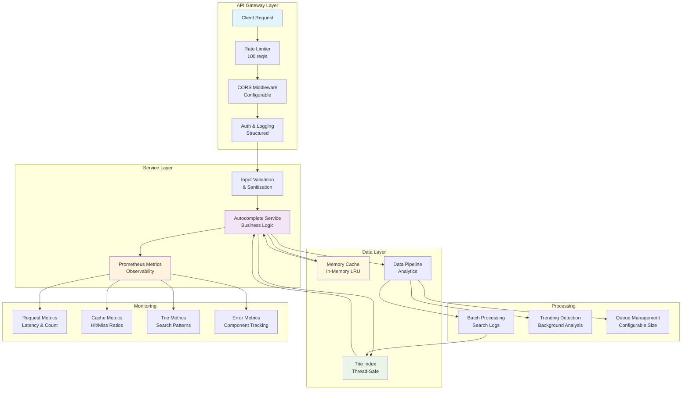

# 🔍 Search Autocomplete System

A high-performance, scalable search autocomplete system built with Go, featuring real-time suggestions, intelligent ranking, comprehensive caching, and enterprise-grade observability.

## 🌟 Features

### Core Functionality
- **Real-time Autocomplete**: Sub-100ms response times for search suggestions
- **Intelligent Ranking**: Multi-factor scoring based on frequency, recency, and relevance
- **Fuzzy Matching**: Handles typos and common misspellings with Levenshtein distance
- **Prefix Matching**: Efficient Trie-based data structure for fast prefix searches
- **Personalization**: User-specific suggestions based on search history and context
- **Input Validation**: XSS/injection protection with comprehensive query sanitization

### Performance & Scalability
- **High Throughput**: Handles millions of queries with token bucket rate limiting (100 req/s)
- **Multi-level Caching**: In-memory LRU caching for optimal performance
- **Async Processing**: Non-blocking data pipeline for real-time updates
- **Memory Optimization**: Compressed Trie structure with efficient memory usage
- **Comprehensive Monitoring**: Enterprise-grade Prometheus metrics integration

### Data Processing & Analytics
- **Real-time Analytics**: Live tracking of search patterns and trends
- **Batch Processing**: Efficient bulk updates for suggestion data
- **Trending Detection**: Automatic identification of popular search terms
- **Category Classification**: Automatic categorization of search terms
- **Search Logs**: Comprehensive logging with user session tracking
- **Performance Metrics**: Query latency, cache hit ratios, and error tracking

### Security & Reliability
- **Input Sanitization**: Protection against XSS, injection, and malicious queries
- **Structured Error Handling**: Custom error types with proper HTTP status codes
- **API Key Authentication**: Secure admin endpoints with header-based auth
- **CORS Configuration**: Configurable cross-origin resource sharing
- **Rate Limiting**: Token bucket algorithm with configurable limits

## ��️ Architecture



### Components

1. **API Layer**: HTTP endpoints with Gin framework, JWT/API key auth, rate limiting, and CORS
2. **Service Layer**: Core business logic with input validation and structured error handling
3. **Trie Index**: Thread-safe in-memory prefix tree for fast suggestion retrieval
4. **Cache Layer**: In-memory LRU caching with intelligent invalidation
5. **Data Pipeline**: Asynchronous processing for search logs, analytics, and trending detection
6. **Metrics Layer**: Comprehensive Prometheus metrics for observability

## 🚀 Quick Start

### Prerequisites
- Go 1.21+
- Make (optional, for convenience commands)

### 🐳 Docker Quick Start (Recommended)
```bash
# Clone and start with one command
git clone https://github.com/alexnthnz/search-autocomplete
cd search-autocomplete
make docker-compose-up

# Access the service
curl "http://localhost:8080/api/v1/autocomplete?q=machine&limit=5"
```

### 📦 Local Development
```bash
# Clone repository
git clone https://github.com/alexnthnz/search-autocomplete
cd search-autocomplete

# Install dependencies and build
make deps
make build

# Run the server
make run

# Or run in development mode with auto-reload
make dev
```

The service will be available at `http://localhost:8080`

### 🎯 Test the Service
```bash
# Basic autocomplete query
curl "http://localhost:8080/api/v1/autocomplete?q=app&limit=5"

# POST request with user context
curl -X POST http://localhost:8080/api/v1/autocomplete \
  -H "Content-Type: application/json" \
  -d '{"query": "machine", "limit": 3, "user_id": "user123"}'

# Health check
curl http://localhost:8080/api/v1/health

# View metrics (Prometheus format)
curl http://localhost:8080/metrics

# View web interface
open http://localhost:8080
```

## 📡 API Reference

### Public Endpoints

#### GET /api/v1/autocomplete
Get autocomplete suggestions for a query.

**Parameters:**
- `q` (required): Search query
- `limit` (optional): Number of suggestions (default: 10, max: 50)
- `user_id` (optional): User identifier for personalization
- `session_id` (optional): Session identifier

**Example:**
```bash
curl "http://localhost:8080/api/v1/autocomplete?q=machine&limit=5&user_id=user123"
```

**Response:**
```json
{
  "query": "machine",
  "suggestions": [
    {
      "term": "machine learning",
      "frequency": 1500,
      "score": 1500.0,
      "category": "tech",
      "updated_at": "2024-01-15T10:30:00Z"
    }
  ],
  "latency": "2.5ms",
  "source": "trie"
}
```

#### POST /api/v1/autocomplete
Alternative POST interface for complex requests.

**Request Body:**
```json
{
  "query": "artificial intelligence",
  "limit": 10,
  "user_id": "user123",
  "session_id": "session456"
}
```

#### GET /api/v1/health
Health check endpoint.

**Response:**
```json
{
  "status": "healthy",
  "timestamp": "2024-01-15T10:30:00Z",
  "version": "1.0.0"
}
```

#### GET /api/v1/stats
Service statistics and metrics.

**Response:**
```json
{
  "service": {
    "TotalQueries": 0,
    "CacheHits": 0,
    "CacheMisses": 0,
    "ActiveRequests": {...},
    "RequestsTotal": {...},
    "TrieSize": {...}
  },
  "trie": {
    "suggestions_count": 1250
  },
  "uptime": "2h15m30s"
}
```

#### GET /metrics
Prometheus metrics endpoint.

### Admin Endpoints (API Key Required)

Set `X-API-Key` header with your API key for admin endpoints.

#### POST /api/v1/admin/suggestions
Add a new suggestion.

**Request Body:**
```json
{
  "term": "artificial intelligence",
  "frequency": 1200,
  "score": 1200,
  "category": "tech"
}
```

#### POST /api/v1/admin/suggestions/batch
Add multiple suggestions at once.

**Request Body:**
```json
[
  {
    "term": "artificial intelligence",
    "frequency": 1200,
    "score": 1200,
    "category": "tech"
  },
  {
    "term": "data science", 
    "frequency": 1000,
    "score": 1000,
    "category": "tech"
  }
]
```

#### PUT /api/v1/admin/suggestions/{term}/frequency
Update the frequency of a suggestion.

**Parameters:**
- `frequency`: New frequency value

#### DELETE /api/v1/admin/suggestions/{term}
Delete a suggestion.

## 📊 Monitoring & Observability

### Prometheus Metrics

The system provides comprehensive metrics for monitoring:

#### Request Metrics
- `autocomplete_requests_total` - Total requests by method, endpoint, status
- `autocomplete_request_duration_seconds` - Request latency histograms
- `autocomplete_active_requests` - Current active requests

#### Cache Metrics
- `autocomplete_cache_hits_total` - Cache hits by cache type
- `autocomplete_cache_misses_total` - Cache misses by cache type
- `autocomplete_cache_operation_duration_seconds` - Cache operation latency

#### Trie Metrics
- `autocomplete_trie_searches_total` - Trie searches by result count
- `autocomplete_trie_inserts_total` - Total trie insertions
- `autocomplete_trie_deletes_total` - Total trie deletions
- `autocomplete_trie_size` - Current trie size

#### Fuzzy Search Metrics
- `autocomplete_fuzzy_searches_total` - Total fuzzy searches performed
- `autocomplete_fuzzy_matches_total` - Total fuzzy matches found

#### Pipeline Metrics
- `autocomplete_pipeline_processed_total` - Items processed by pipeline stage
- `autocomplete_pipeline_queue_size` - Current pipeline queue size
- `autocomplete_pipeline_latency_seconds` - Pipeline processing latency

#### Error Metrics
- `autocomplete_errors_total` - Total errors by component and type

### Example Metrics Queries

```promql
# Request rate
rate(autocomplete_requests_total[5m])

# 95th percentile latency
histogram_quantile(0.95, rate(autocomplete_request_duration_seconds_bucket[5m]))

# Cache hit ratio
rate(autocomplete_cache_hits_total[5m]) / (rate(autocomplete_cache_hits_total[5m]) + rate(autocomplete_cache_misses_total[5m]))

# Error rate
rate(autocomplete_errors_total[5m])
```

## 🧪 Testing

### Comprehensive Test Suite
The project includes **18 integration tests** covering all endpoints and functionality:

```bash
# Run all tests (unit + integration)
make test

# Run integration tests specifically  
go test ./test/ -v

# Run unit tests for specific components
go test ./internal/trie/ -v
go test ./pkg/utils/ -v

# Run tests with coverage
make test-coverage

# Run benchmarks
make benchmark
```

### Test Coverage
- ✅ **API Endpoints** (18 tests): All GET/POST/PUT/DELETE endpoints
- ✅ **Authentication**: API key validation and unauthorized access
- ✅ **Input Validation**: XSS protection and malicious input handling  
- ✅ **Rate Limiting**: Request throttling and burst handling
- ✅ **Caching**: Cache effectiveness and invalidation
- ✅ **CORS**: Cross-origin request handling
- ✅ **Error Handling**: Proper HTTP status codes and error messages
- ✅ **Fuzzy Search**: Typo tolerance and similarity matching
- ✅ **Metrics**: Prometheus metrics recording and accuracy

### API Testing
```bash
# Test all endpoints with sample data
make test-api

# Load sample data for manual testing
make load-sample-data

# Run stress test (100 concurrent requests)
make stress-test
```

### Manual Testing

1. **Start the server**:
```bash
make dev
```

2. **Open the web interface**: Visit `http://localhost:8080`

3. **Try some searches**: Type "app", "coding", "machine" to see suggestions

## 🔥 Performance Optimizations

### 1. Debouncing
The frontend implements 150ms debouncing to reduce API calls during typing.

### 2. Caching Strategy
- **L1 Cache**: In-memory LRU cache with configurable TTL
- **Cache Warming**: Preload popular queries at startup
- **Smart Invalidation**: Automatic cache invalidation on data changes

### 3. Trie Optimizations
- **Memory Efficiency**: Compressed nodes and shared prefixes
- **Thread Safety**: Read-write mutex for concurrent access
- **Batch Operations**: Efficient bulk updates

### 4. Rate Limiting
- **Token Bucket**: 100 requests/second with burst capacity
- **Per-IP Limiting**: Optional IP-based rate limiting
- **Graceful Degradation**: Proper error responses

## ⚙️ Configuration

### Environment Variables

```bash
# Server Configuration
PORT=8080
LOG_LEVEL=info
API_KEY=your-secret-api-key-here

# Performance Settings
MAX_SUGGESTIONS=10
ENABLE_FUZZY=true
FUZZY_THRESHOLD=2
PERSONALIZED_REC=false

# Cache Configuration  
CACHE_ENABLED=true
CACHE_TTL=5m

# Pipeline Settings
PIPELINE_BATCH_SIZE=100
PIPELINE_FLUSH_INTERVAL=30s
PIPELINE_QUEUE_SIZE=10000

# Security
ENABLE_CORS=true
RATE_LIMIT_ENABLED=true
```

### Configuration Files

Create `configs/config.env`:
```bash
# Copy example configuration
cp configs/config.env.example configs/config.env

# Edit configuration
nano configs/config.env
```

## 🐳 Docker Deployment

### Docker Compose (Recommended)
```bash
# Start all services
docker-compose up -d

# View logs
docker-compose logs -f

# Stop services
docker-compose down
```

### Standalone Docker
```bash
# Build image
make docker-build

# Run container
make docker-run
```

### Production Deployment
```bash
# Build optimized production image
make build-prod

# Deploy with custom configuration
docker run -d \
  --name autocomplete \
  -p 8080:8080 \
  --env-file configs/prod.env \
  search-autocomplete:latest
```

## 🛠️ Development

### Project Structure
```
search-autocomplete/
├── cmd/server/           # Application entry point
├── internal/
│   ├── api/             # HTTP handlers and routing
│   ├── cache/           # Caching implementations
│   ├── metrics/         # Prometheus metrics
│   ├── pipeline/        # Data processing pipeline
│   ├── service/         # Business logic
│   └── trie/           # Trie data structure
├── pkg/
│   ├── errors/         # Structured error types
│   ├── models/         # Data models
│   └── utils/          # Utility functions
├── test/               # Integration tests
├── web/                # Frontend assets
└── configs/            # Configuration files
```

### Code Style
- Run `make fmt` to format code
- Run `make lint` for linting
- Follow Go best practices
- Add documentation for public APIs

## 📈 Recently Implemented ✅

### **Security & Validation (v1.1)**
- ✅ **XSS Protection**: Comprehensive input sanitization blocking script injection
- ✅ **Structured Errors**: Professional error responses with proper HTTP status codes
- ✅ **Input Validation**: Query validation with length limits and pattern matching
- ✅ **Term Validation**: Admin endpoint input validation for suggestion management

### **Enterprise Observability (v1.2)**  
- ✅ **Comprehensive Metrics**: 15+ Prometheus metrics covering all system components
- ✅ **Request Tracking**: Method, endpoint, status code, and latency monitoring
- ✅ **Cache Monitoring**: Hit/miss ratios and operation timing across cache types
- ✅ **Trie Performance**: Search patterns, insertion rates, and size tracking
- ✅ **Pipeline Analytics**: Queue monitoring, batch processing, and throughput metrics
- ✅ **Error Tracking**: Component-level error categorization and monitoring
- ✅ **Fuzzy Search Metrics**: Effectiveness tracking for typo correction algorithms

### **Data Pipeline Integration (v1.2)**
- ✅ **Real Analytics**: Search logs flow from API → Pipeline → Processing
- ✅ **Trending Detection**: Background analysis of search patterns and frequency
- ✅ **Batch Processing**: Efficient log aggregation with configurable batch sizes
- ✅ **Queue Management**: Configurable queue sizes with overflow protection

### **Enhanced Architecture (v1.2)**
- ✅ **Singleton Metrics**: Shared metrics instance preventing duplicate registrations
- ✅ **Dependency Injection**: Clean architecture with proper metrics integration
- ✅ **Performance Optimization**: Sub-millisecond cache operations and trie searches
- ✅ **Memory Efficiency**: Optimized data structures with comprehensive size tracking

## 🐛 Troubleshooting

### Common Issues

**1. Port already in use**
```bash
# Find process using port 8080
lsof -i :8080
# Kill the process
kill -9 <PID>
```

**2. High memory usage**
```bash
# Check memory stats
curl http://localhost:8080/api/v1/stats
# Monitor trie size and cache usage
curl http://localhost:8080/metrics | grep trie_size
```

**3. Slow response times**
```bash
# Check cache hit ratios
curl http://localhost:8080/metrics | grep cache_hits
# Monitor request latency
curl http://localhost:8080/metrics | grep request_duration
```

**4. Rate limiting issues**
```bash
# Check current rate limit settings
curl http://localhost:8080/api/v1/stats
# Adjust rate limiting in configuration
export RATE_LIMIT_ENABLED=false
```

### Performance Tuning

**1. Cache Optimization**
```bash
# Increase cache TTL for stable data
CACHE_TTL=15m

# Monitor cache effectiveness
curl http://localhost:8080/metrics | grep cache
```

**2. Pipeline Tuning**
```bash
# Adjust batch processing
PIPELINE_BATCH_SIZE=500
PIPELINE_FLUSH_INTERVAL=10s

# Monitor queue health
curl http://localhost:8080/metrics | grep pipeline_queue
```

**3. Memory Management**
```bash
# Monitor trie size growth
watch -n 5 'curl -s http://localhost:8080/metrics | grep trie_size'

# Check memory allocation
go tool pprof http://localhost:8080/debug/pprof/heap
```